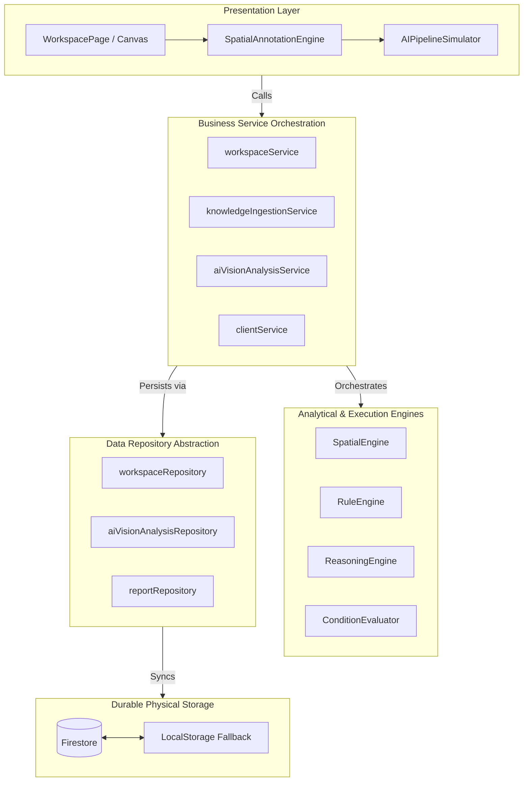
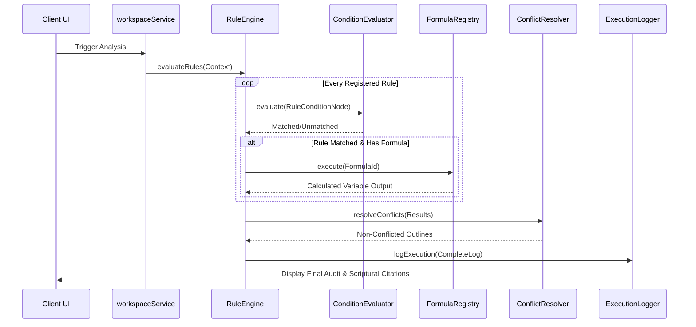

# System Architecture

This document details the software architecture, layered design, module relationships, and data workflows of the **URJAFLUX AI OS** platform.

---

## Overall System Architecture

URJAFLUX AI OS is built upon a **Decoupled Layered Architecture**, strictly separating presentation, state management, orchestration logic, deterministic execution engines, and physical data access layers. This separation prevents spaghetti-logic from bleeding into the business models, ensuring complete auditability, testability, and deterministic behavior required for classical Vedic calculations.



---

## Layered Design

### 1. Presentation Layer (React & Vite)
* **Visual Workspaces**: Complex drawing and spatial-energy annotation canvases configured with fluid responsive designs, coordinate panning, zooming, and interactive layer selections.
* **Component Partitioning**: UI code is modularized to avoid token exhaustion and file bloating (e.g., separating `SpatialAnnotationEngine` from `AIPipelineSimulator`).
* **Animations**: Pure visual transitions and interactive states are managed using `motion/react` to represent multi-system diagnostic calculations smoothly.

### 2. Business Service Layer (Services)
* **Domain Orchestrators**: Acts as the boundary for transaction workflows (e.g., `workspaceService` handles workspace loading, coordinate offsets, file storage uploads, and database saves).
* **State Management & Fallbacks**: Monitors Firebase connection states. When Firestore is offline, services seamlessly route read/write operations to safe local fallbacks (`localStorage` adapters), ensuring data persistence is never disrupted.
* **Separation of Concerns**: Services never evaluate rules or perform coordinate math in-line; they delegate computation to the **Engine Layer**.

### 3. Core Engine Layer (Engines)
* **Zero-Dependency Core**: Pure algorithms and mathematical libraries, separated from UI frameworks or data storage layers.
* **Rule Engine**: Parses declarative, JSON-based rules, runs AST condition branches, compiles execution logs, and performs safe, sandboxed expression evaluations.
* **Spatial Geometry Engine**: Normalizes user-drawn polygon coordinate arrays, aligns them to compass offsets, and determines zone containment (e.g., detecting if a bedroom intersects with the "North-East" sacred zone).
* **Reasoning Engine**: Performs complex Astro-Vastu conflict resolution (e.g., evaluating standard Vastu rules against specific Lal Kitab zodiac constraints) using multi-tier logical pipelines.

### 4. Repository Layer (Repositories)
* **Abstract Data Access**: Provides a unified API interface for reading and writing domain entities, decoupling the physical database technology from the application services.
* **Persistence Neutrality**: Repository methods (e.g., `workspaceRepository.getById`) can easily switch between live Firestore endpoints, memory caching, or indexedDB fallbacks without changing a single line of business logic.

---

## Module Relationships & Flows

### Knowledge Flow (Ingestion & Extraction)
1. **Source Upload**: The consultant uploads a classical book structure or scripture page (`IngestedBook`).
2. **OCR / Parser**: OCR text blocks are normalized into physical pages and chapters.
3. **Fidelity Extraction**: The AI/Scriptural engine identifies rules (`ExtractedRule`) and mathematical formulas (`ExtractedFormula`).
4. **Relational Indexing**: Rules and formulas are registered inside the Knowledge Repository, linked directly to their scriptural citations (evidence nodes).

```text
Vedic Source Book (Mayamatam)
     ↓
 OCR Ingestion
     ↓
 ExtractedRules & ExtractedFormulas (Vedic RAG Evidence Nodes)
     ↓
 Registered with Knowledge Registry
```

### Rule Evaluation Flow
1. **Context Construction**: Active coordinates, room structures, and client astrological parameters are assembled into a unified state representation (`RuleContext`).
2. **AST Evaluation**: The `ConditionEvaluator` processes the condition tree of active rules.
3. **Formula Triggering**: If a rule matches, its linked calculations (e.g., Ayadi formula calculations) are dispatched to the `FormulaRegistry` to produce dynamic numbers.
4. **Conflict Resolution**: If Vastu recommendations conflict with Astro-Vastu parameters, the `ConflictResolver` applies scriptural override chains (e.g., prioritizing planetary defense lines).
5. **Execution Logging**: Results, metadata, and scriptural evidence citations are saved into Firestore via the `ExecutionLogger`.


