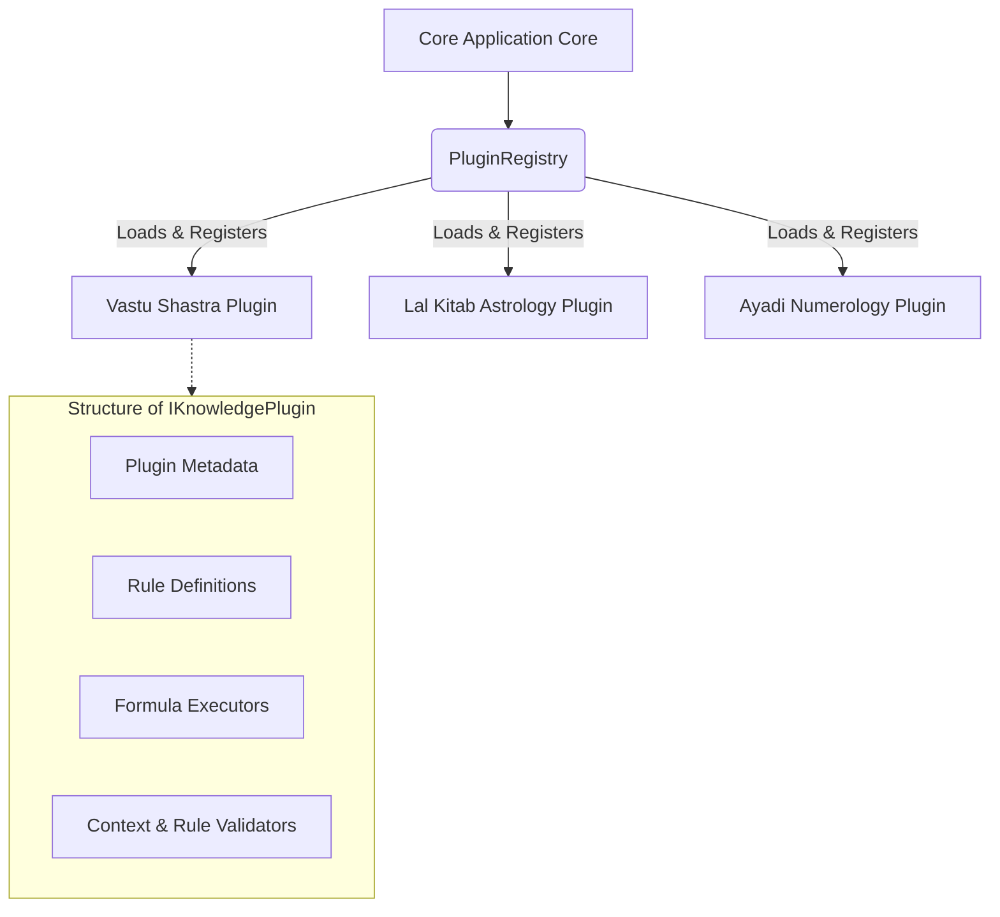

# Plugin Architecture

This document describes the extensible plugin-based design of **URJAFLUX AI OS**, explaining how developers and contributors can register custom scriptures, rules, calculations, and validators.

---

## Architecture Overview

To prevent monolithic bloating, URJAFLUX AI OS exposes a decoupled **Knowledge Plugin System**. This allows separate traditional domains—such as Vastu Shastra, Lal Kitab Astrology, and Ayadi Numerology—to exist as modular packages. Each plugin defines its own rules, mathematical formulas, contexts, and validation checks.



---

## Core Interfaces

### 1. Plugin Metadata (`PluginMetadata`)
Maintains identifying details, versions, and resolving weights for the plugin.
```typescript
export interface PluginMetadata {
  id: string;        // Permanent namespace ID, e.g., "vastu", "lal_kitab"
  name: string;      // User-friendly name
  description: string;
  version: string;   // SemVer representation, e.g., "1.2.0"
  priority: number;  // Default priority tier used for conflict overrides
}
```

### 2. Knowledge Plugin Interface (`IKnowledgePlugin`)
Any traditional scripture or methodology module must implement this contract.
```typescript
export interface IKnowledgePlugin {
  metadata: PluginMetadata;
  rules: RuleDefinition[];
  formulas: FormulaExecutor[];
  
  // Opt-in validators to verify incoming contexts and rules during registration
  validateContext?: (context: RuleContext) => { isValid: boolean; errors: string[] };
  validateRule?: (rule: RuleDefinition) => { isValid: boolean; errors: string[] };
}
```

---

## Plugin Lifecycle

### 1. Instantiation & Setup
A developer defines the custom plugin object, bundling its rules (JSON AST) and formula executors (TypeScript classes matching `FormulaExecutor`).

### 2. Verification (Validators)
When registering with the `RuleEngine`, the engine runs validation routines:
* **Rule Syntax Checks**: Ensures matching AST parameters and avoids referencing non-existent formulas or evidence tags.
* **Context Schema Guarding**: Pre-checks that the active client workspace meets the minimum coordinate metrics required for evaluation.

### 3. Load & Registration
The plugin registers with the `PluginRegistry` and central repositories:
```typescript
export class PluginRegistry {
  private plugins = new Map<string, IKnowledgePlugin>();

  public register(plugin: IKnowledgePlugin): void {
    if (this.plugins.has(plugin.metadata.id)) {
      throw new Error(`[URJAFLUX AI OS] Duplicate plugin registration: ${plugin.metadata.id}`);
    }
    this.plugins.set(plugin.metadata.id, plugin);
  }
  
  public get(pluginId: string): IKnowledgePlugin | undefined {
    return this.plugins.get(pluginId);
  }
}
```

### 4. Evaluation Dispatch
During active audits, matched rule structures call the plugin's registered formulas dynamically via the central `FormulaRegistry`.

---

## Rule Packs & Formula Packs

To organize complex databases, rules and formulas are structured into dedicated files:
* **Rule Packs**: Standardized, declarative collections of Vastu or astrological rules stored in JSON-like TypeScript declarations.
* **Formula Packs**: Reusable math structures that calculate dimensions, areas, and alignments based on Vedic scripts.

Example structure of a simple Formula:
```typescript
export class AyadiYoniCalculator implements FormulaExecutor {
  public readonly formulaId = "FORMULA-AYADI-YONI";
  public readonly name = "Ayadi Yoni Calculation";
  public readonly description = "Calculates the Yoni direction index from plot dimensions.";

  public execute(context: RuleContext): number {
    const width = Number(context.calculatedValues.plotWidth || 0);
    const length = Number(context.calculatedValues.plotLength || 0);
    const area = width * length;
    // Classical formula: (Area * 8) % 12
    return (area * 8) % 12;
  }
}
```

---

## Future Plugin Extensions

This decoupled architecture allows third-party integrations:
1. **Chinese Feng Shui Plugin**: Integrating Bagua map alignments and Five Elements analysis.
2. **Modern Acoustic/Lighting Plugin**: Fusing scriptural guidelines with modern decibel, lux, and air circulation sensors.
3. **Machine Vision Core**: Integrating custom OCR and layout models directly into the pipeline as geometric context providers.
