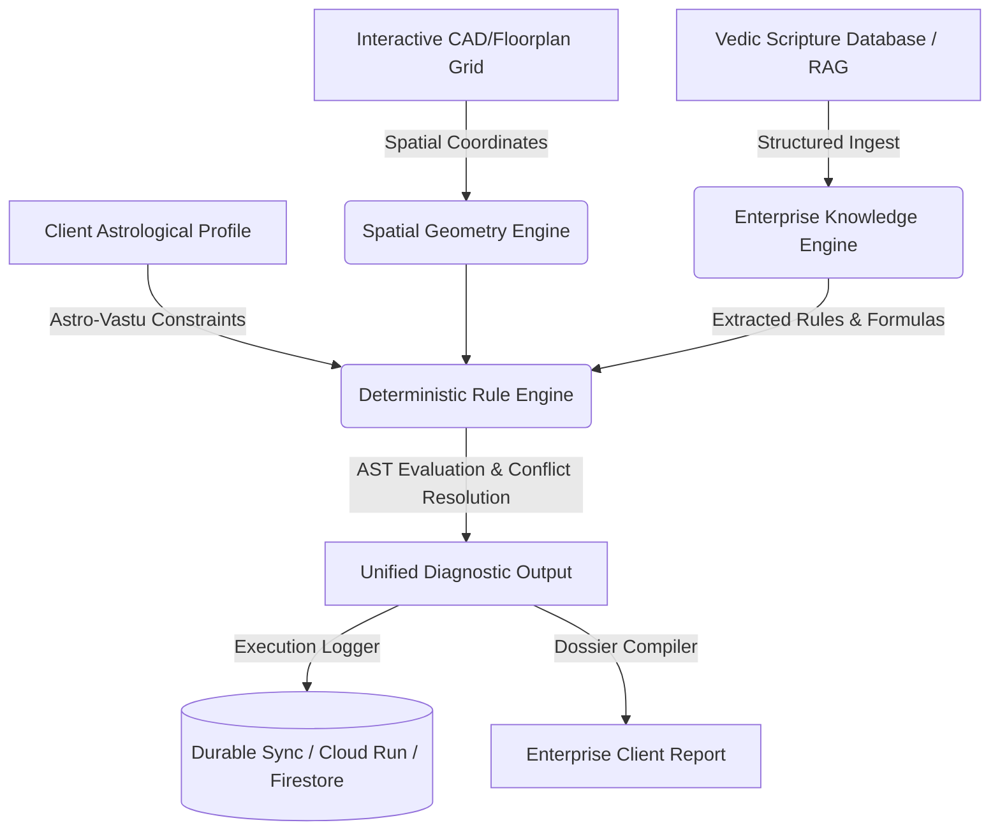

# URJAFLUX AI OS

An enterprise-grade Spatial Vastu Audit, Astrological Synthesis, and Vedic Knowledge Management Operating System.

---

## Project Vision

URJAFLUX AI OS is a unified, deterministic platform for spatial-energy analysis, astrological synthesis, and Vedic scripture RAG (Retrieval-Augmented Generation). By blending classical scriptures like the *Mayamatam*, *Manasara*, *Samarangana Sutradhara*, and *Viswakarma Vastushastram* with modern coordinate geometry, Computer Vision (CV), Lal Kitab Astrology, and Ayadi Numerology, URJAFLUX AI OS transforms architectural auditing from an empirical trade into an explainable, software-driven science.

Designed for professional consultants, enterprise real estate firms, and Vedic architects, the platform provides deep structural analytics, deterministic rule evaluations, clear scriptural evidence-chains, and multi-layered remedies that can be deployed instantly in an offline-first, highly secure environment.

---

## System Overview

URJAFLUX AI OS coordinates three core analytical pillars to generate unified recommendations:
1. **Spatial Geometry Engine**: Interprets architectural floor plans, spatial pins, orientation degrees, and boundary coordinates to construct Vastu energy grids (e.g., 9x9 Pada grids) and normalize spatial vectors.
2. **Deterministic Rule Engine**: An AST (Abstract Syntax Tree)-based execution pipeline that processes Vedic rules, resolves cross-system conflicts (e.g., standard Vastu vs. specific Lal Kitab restrictions), and logs full audit trails.
3. **Enterprise Knowledge Engine**: A RAG-ready, structured Vedic knowledge ingestion system that maps canonical books, chapters, sections, and verses to active rules, formulas, and evidence nodes.



---

## Architecture Overview

URJAFLUX AI OS utilizes a clean, decoupled, layered enterprise architecture:
* **Presentation Layer**: React (with Vite, Tailwind CSS, and Motion) providing rich, responsive workspace interfaces, visual coordinate annotation, and real-time canvas overlays.
* **Service Layer**: Decoupled, state-free business logic orchestrators (e.g., `workspaceService`, `propertyService`, `knowledgeIngestionService`).
* **Engine Layer**: Standalone execution, reasoning, and mathematical computation libraries (e.g., `RuleEngine`, `ConditionEvaluator`, `SpatialEngine`).
* **Repository Layer**: Data access abstractions (e.g., `workspaceRepository`, `aiVisionAnalysisRepository`) separating storage engines from domain entities.
* **Data Layer**: Durable Firestore synchronization with local key-value storage fallbacks (`localStorage`), enabling reliable offline-first execution.

---

## Technology Stack

* **Frontend Framework**: React 18+ (TypeScript), Vite
* **Styling & UI**: Tailwind CSS, Lucide React (Icons), Motion/React (Animations)
* **Databases & Cloud**: Firebase (Authentication, Firestore, Cloud Storage)
* **Visualization & Analytics**: Recharts, Custom Canvas Matrix APIs
* **Build System**: TypeScript Compiler (`tsc`), Node.js, npm, Bun

---

## Installation

To run URJAFLUX AI OS locally, ensure you have Node.js (v18+) and npm (or Bun) installed.

### 1. Clone the Workspace
Clone or download the project into your workspace directory.

### 2. Install Dependencies
```bash
npm install
```

### 3. Set Up Environment Variables
Create a `.env` file in the root directory based on `.env.example`:
```env
# Example .env file
VITE_FIREBASE_API_KEY=your_api_key_here
VITE_FIREBASE_AUTH_DOMAIN=your_auth_domain_here
VITE_FIREBASE_PROJECT_ID=your_project_id_here
VITE_FIREBASE_STORAGE_BUCKET=your_storage_bucket_here
VITE_FIREBASE_MESSAGING_SENDER_ID=your_sender_id_here
VITE_FIREBASE_APP_ID=your_app_id_here
```

### 4. Run the Dev Server
```bash
npm run dev
```
The server binds to port `3000` on localhost automatically.

---

## Development Workflow

1. **Local Development**: Code is checked incrementally using TypeScript and modern linting rules.
2. **Type Safety**: Enforced strictly. Avoid any use of `any` types. Ensure all models match the schemas in `/src/types`.
3. **Build and Verification**:
   Before committing, always run the standard build and verification scripts:
   ```bash
   npm run build
   npm run lint
   ```

---

## Project Structure

```text
/
├── docs/                      # Enterprise Documentation System
├── src/
│   ├── components/            # High-fidelity visual interfaces and specs
│   ├── data/                  # Core static datasets and mock data generators
│   ├── engines/               # Abstract execution engines
│   │   ├── pdf/               # PDF Compiler engine
│   │   ├── report/            # Diagnostic report formatting engine
│   │   └── ruleEngine/        # Decoupled Rule Engine execution modules
│   ├── knowledge/             # Canonical knowledge packs and registries
│   ├── reasoning/             # Astrological and multi-layered reasoning
│   ├── repositories/          # Isolated repository patterns for entities
│   ├── services/              # Clean Business Domain Services
│   ├── spatial/               # Coordinate geometry normalizer and canvas engines
│   ├── types/                 # Standardized TypeScript interface definitions
│   └── vastu/                 # Vastu specific ontologies and rule definitions
├── firebase-blueprint.json    # Initial Firestore schemas
├── firestore.rules            # Security guidelines for cloud database
├── package.json               # Package declarations and scripts
└── tsconfig.json              # TypeScript compilation specifications
```

---

## Sprint History

* **Sprint 1.0**: Core Spatial Coordinate Canvas, Pada mapping, and grid generation.
* **Sprint 2.0**: Vastu Vithis, Vastu Purusha Mandala layout, and orientation offsets.
* **Sprint 3.0**: Lal Kitab Astrological analysis and Numerology engine integration.
* **Sprint 4.0**: Enterprise Knowledge Ingestion, book parsing, and scripture RAG.
* **Sprint 5.0**: Enterprise Architecture Cleanup and Durable Firestore Synclist Pattern.
* **Sprint 5.5**: **Enterprise Documentation System** (Current).

---

## Future Roadmap

1. **Vedic OCR Integration**: Real-time high-fidelity Sanskrit OCR on raster scripture pages.
2. **CAD File Parser**: Native `.dxf` and `.dwg` floor plan coordinate extraction.
3. **AI Vision Deep Learning**: Fully hosted neural networks for detecting furniture and architectural structures from images.
4. **White-label Dossier Customizer**: Rich, drag-and-drop report layout builder for high-end corporate agencies.
